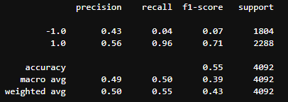
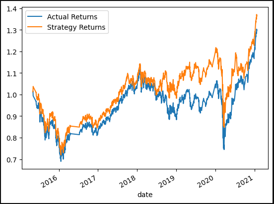

# ml_trading_bot
This is an algorithmic trading bot that learns and adapts to new data and evolving markets. This bot enhance the existing trading signals with machine learning algorithms that can adapt to new data and automate the trade decisions.
This report about the bot presents a comparison of the performance of the machine learning models based on the trading predictions that each makes and the resulting cumulative strategy return.

 

<b> <u> Baseline performance for the current trading algorithm </u> </b>

Base Model - Accuracy level is 55%, Recall level is 0.96 and Precision is 0.56

 

<b> <u> Tune the training algorithm by adjusting the size of the training dataset </u> </b>

 
<b> Question: </b> What impact resulted from increasing or decreasing the training window?

<b> Answer: </b> 
* By increasing the training window from 3 months to 6 months the Accurracy level increased by 1% (from 55% to 56%) and the recall also got better by 2 decimal points from 0.96 to 0.98.

* By decreasing the training window from 3 months to 1 month the Accurracy level and Recall remain unchanged.

 

<b> <u> Tune the trading algorithm by adjusting the SMA input features </u> </b>

 
<b> Question: </b> What impact resulted from increasing or decreasing either or both of the SMA windows?

<b> Answer: </b>
* By increasing the short window from 4 to 6 and also increasing the long window from 100 to 110, for the same size of training data-set the accuracy and recall both have increased.

* By increasing only the short window from 4 to 6, for the same size of training data-set the accuracy level increased to 56% and the recall level also increased to 99%.

* By increasing only the long window from 100 to 110, for the same size of training data-set the accuracy remain unchanged but recall have decreased.

 

<b> <u> Conclusion from the Tunning performed  </u> </b>

The best set of parameters which gave an improved trading algorithim returns are short window of 6 and long window of 100 for a 3 months training dataset. Accuracy is 56%, recall level is 0.99 and precision is 0.56 .

 

<b> <u> Performance of the new machine using the AdaBoost machine learning model </u> </b>

AdaBoost Model - Accuracy level is 85%, Recall level is 0.92 and Precision is 0.84

 

<b> Question: </b> Did this new model perform better or worse than the provided baseline model? Did this new model perform better or worse than your tuned trading algorithm?

<b> Answer: </b> 
By using the Ada Boost Classifer model the accuracy increased hugely to 85% compared to both the base model having 55% and tuned model having 56%. But the recal level have decreased slightly to 0.92 compared to 0.95 for the base model and the 0.99 compared to the tuned algorithm. With high accuracru and recall level at 0.92 the AdaBoost model is a better perfroming model compared to both the above base and tuned algorithms.